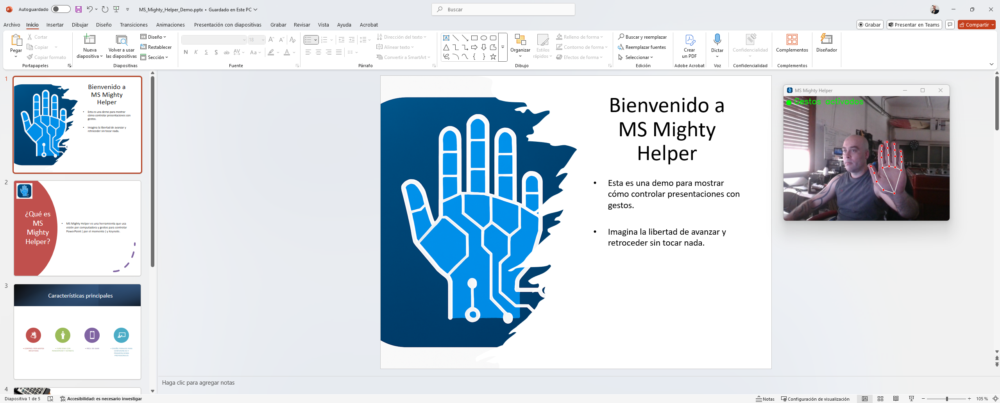
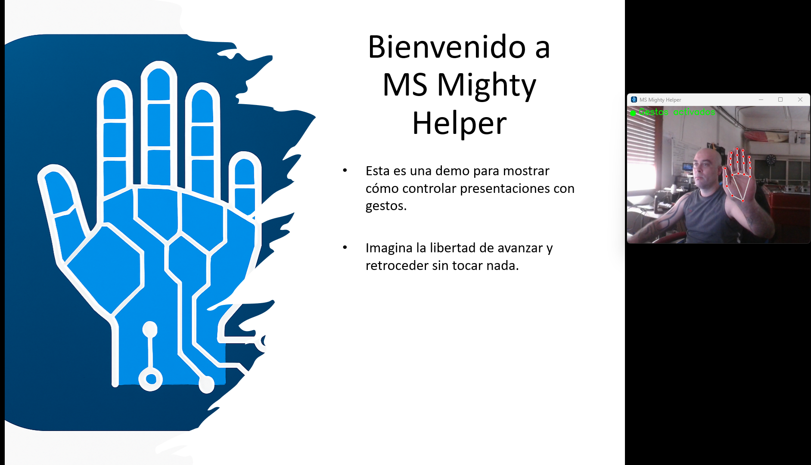
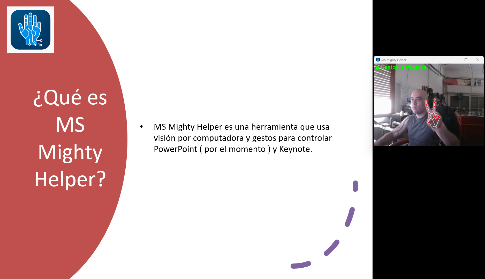
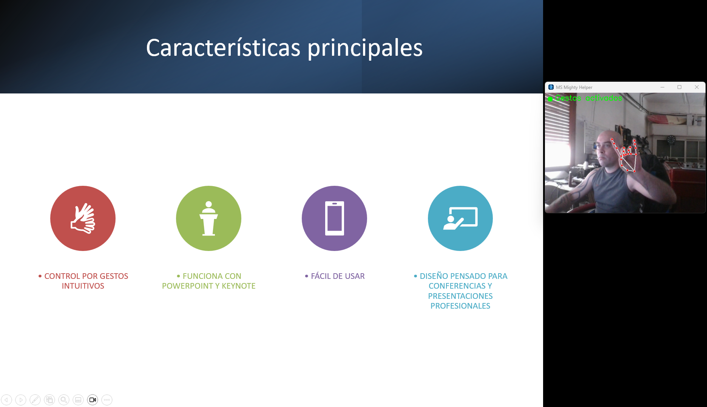
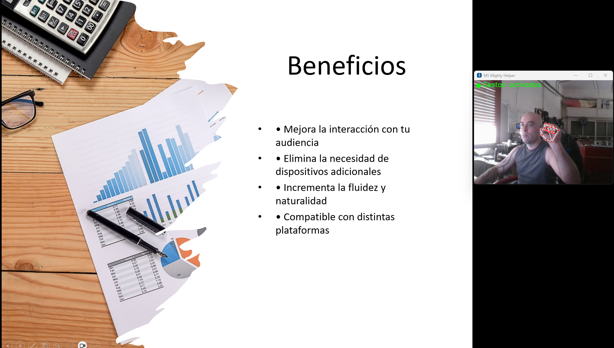
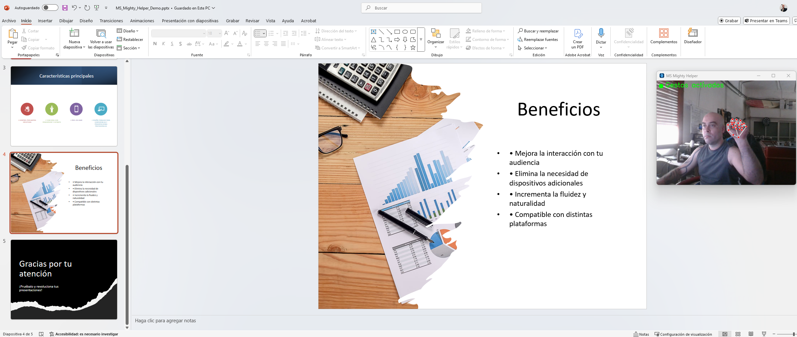
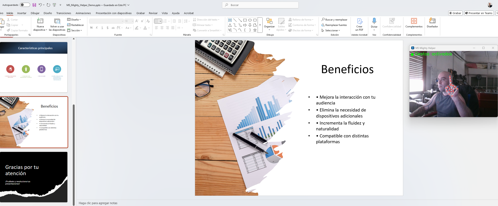
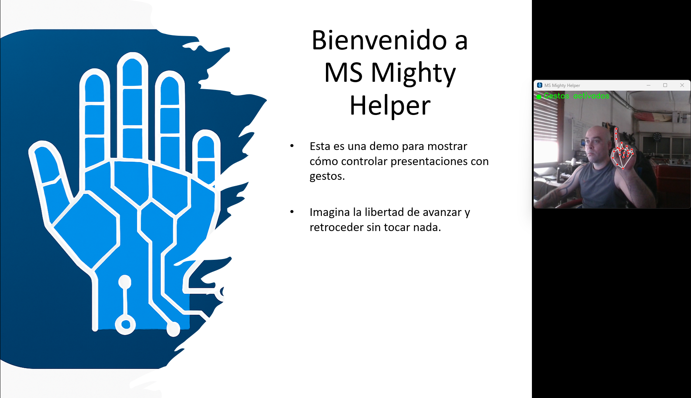

# 🚀 Mighty Helper
 

> **El asistente definitivo para controlar tus presentaciones con gestos naturales y sin complicaciones.**

---

## 🎯 ¿Qué es Mighty Helper?

Mighty Helper es una **herramienta inteligente y elegante** que te permite controlar tus presentaciones en PowerPoint (y otras apps compatibles) usando solo la cámara y **gestos de la mano**. Olvídate del clicker, ratón o teclado: ¡mueve tu mano y controla tus diapositivas de forma natural y profesional!

Ideal para conferencias, clases, reuniones y presentaciones que necesitan un toque tecnológico sin complicaciones.

---

## ✋ Funcionalidades principales

| Acción                      | Gesto por defecto                         | Descripción rápida                              |
|----------------------------|------------------------------------------|------------------------------------------------|
| ▶️ Iniciar presentación     | Mano abierta 🖐️                          | Empieza la presentación desde la diapositiva actual |
| 🔄 Iniciar desde el principio| Palma girada hacia ti 🤚                  | Comienza la presentación desde el primer slide |
| 👉 Avanzar diapositiva       | Mano abierta con dedos juntos ✋          | Avanza a la siguiente diapositiva               |
| 👈 Retroceder diapositiva    | Mano con pulgar recogido (4 dedos abiertos) ✋ | Retrocede a la diapositiva anterior            |
| ⏹️ Salir de presentación     | Puño cerrado ✊                           | Finaliza la presentación y vuelve al modo normal |

---

## ⚙️ ¿Cómo funciona?

- Usa **MediaPipe Hands** para detectar la posición y estado de los dedos en tiempo real.
- Detecta gestos claros y naturales para controlar PowerPoint usando **pyautogui** para enviar teclas.
- Funciona en segundo plano con icono de bandeja, para que puedas activarlo o desactivarlo fácilmente.
- Compatible con Windows y cámara web estándar.
- Permite usar los gestos incluso cuando PowerPoint no está en modo presentación (modo "LifeShow").

---

## 📸 Capturas

---
## 🚀 Binario Compilado para uso rápido

https://github.com/mr-lukhack/Mighty-Helper/releases/tag/ReleaseCandidate

## 🚀 Instalación ( Pronto se liberará el código de la versión Free )

"To be uploaded soon"

🤝 Contribuciones
¡Contribuciones son bienvenidas! Si quieres añadir nuevas funcionalidades, mejorar la detección o proponer nuevos gestos, abre un issue o pull request.

💡 Ideas futuras
Soporte para otras apps (Keynote, Google Slides)

Más gestos personalizados y configurables

Integración con asistentes de voz

Feedback visual mejorado con realidad aumentada

🛡 Licencia
MIT License © 2025 Lukdev (Lucas Manuel Aguilar Llamas)

📬 Contacto
Si quieres ponerte en contacto, sugerir algo o simplemente decir hola, aquí estoy:

GitHub: https://github.com/mr-lukhack

LinkedIn: https://www.linkedin.com/in/lukhack/

Email: picateclas @ pronton .me

¡Controla tus presentaciones y el navegador sin esfuerzo como un pro y deja que tus manos hablen por ti! 🙌

Hecho con ❤ y código limpio por Lukdev
